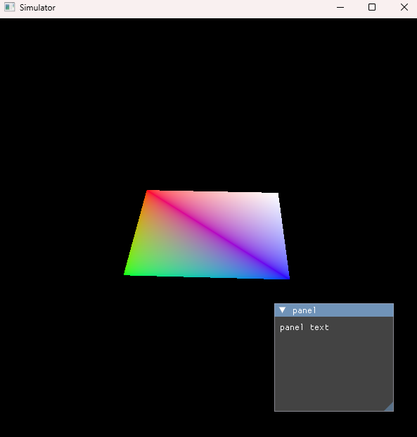

# Vulkan renderer

My first renderer in Vulkan\
It's simple, but made with love <3

## before setup

- Make sure you have intalled cmake version 3.16 or later
- Vulkan SDK should be installed under C:/VulkanSDK. If the path is different, open file Renderer/VulkanSDK.cmake and edit it appropriately.

## setup

- run cmake-gen.bat
- note that linking with glfw might not work. If that's the case, build glfw separately from Visual Studio
